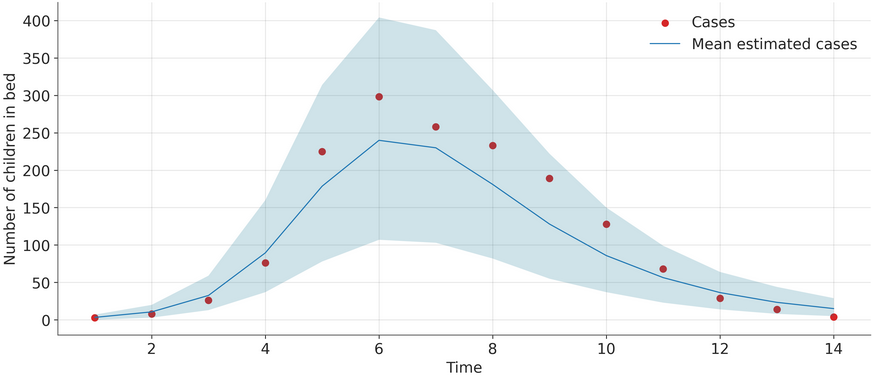

# compartmental-models

# Epidemiological Modeling with CmdStanPy: SIR and SEIR Models

This project demonstrates how to fit Susceptible-Infected-Recovered (SIR) and Susceptible-Exposed-Infected-Recovered (SEIR) epidemiological models to outbreak data using `cmdstanpy`. The analysis is performed on flu and simulated incidence data from [StatML4Pophealth](https://github.com/MLGlobalHealth/StatML4PopHealth)). The main goal was to run the inference on the initial data for the SIR model (result in the plot below), as well as for the SEIR model. 

## Installation

This project relies heavily on `cmdstanpy`. Ensure it's installed correctly.

```python
# Install utilities (if not already present)
# !curl -O "https://raw.githubusercontent.com/MLGlobalHealth/StatML4PopHealth/main/practicals/resources/scripts/utilities.py"

# from utilities import custom_install_cmdstan, test_cmdstan_installation
# custom_install_cmdstan()
